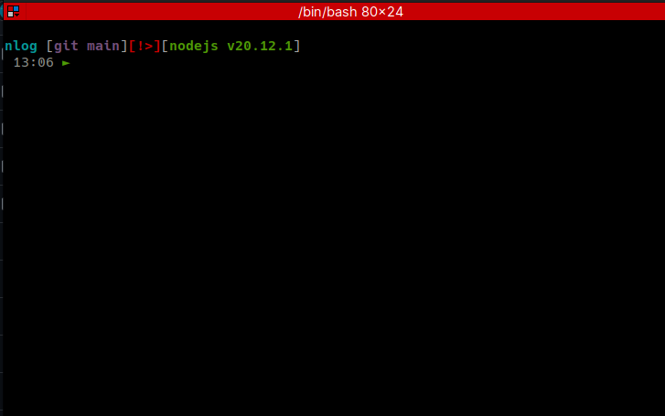

# Terminal Configuration

Here's how I've customized my terminal using [starship.rs](https://starship.rs).

## Prerequisites
- Set up and install Starship by following the [official documentation](https://github.com/starship/starship).
- Replace the default `starship.toml` with this configuration.

I prefer a minimal and clean setup, but feel free to customize to your liking!

